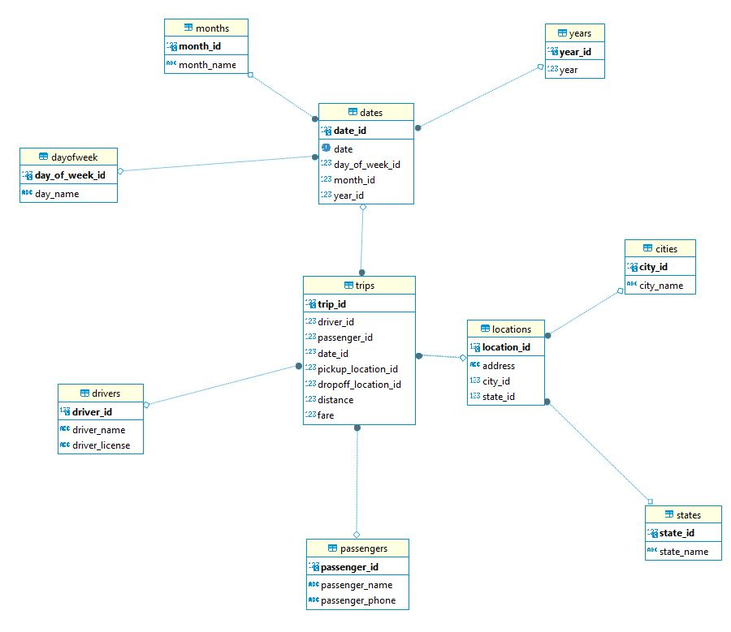

# model-snowflake
Создание модели данных снежинка для анализа данных о поездках в такси

## Таблица фактов
trips – Поездки <br>

## Таблицы измерений
drivers – Водители <br>
passengers – Пассажиры <br>
dates – Даты <br>
years - Года <br>
months - Месяца <br>
dayofweek - Дни недели <br>
locations – Местоположения <br>
states - Штаты <br>
cities - Города <br>

## Поля

### trips (Поездки)
trip_id – Идентификатор поездки <br>
driver_id – Идентификатор водителя <br>
passenger_id – Идентификатор пассажира <br>
date_id – Идентификатор даты <br>
pickup_location_id – Идентификатор места посадки <br>
dropoff_location_id – Идентификатор места высадки <br>
distance – Расстояние <br>
fare – Стоимость проезда <br>

### drivers (Водители)
driver_id – Идентификатор водителя <br>
driver_name – Имя водителя <br>
driver_license – Номер водительского удостоверения <br>

### passengers (Пассажиры)
passenger_id – Идентификатор пассажира <br>
passenger_name – Имя пассажира <br>
passenger_phone – Телефон пассажира <br>

### dates (Даты)
date_id – Идентификатор даты <br>
date – Дата <br> 
day_of_week_id – Идентификатор дня недели <br>
month_id – Идентификатор месяца <br>
year_id – Идентификатор года <br>

#### dayofweek (Дни недели)
day_of_week_id – Идентификатор дня недели <br>
day_name – Название дня недели <br>

#### months (Месяцы)
month_id – Идентификатор месяца <br>
month_name – Название месяца <br>

#### years (Годы)
year_id – Идентификатор года <br>
year – Год <br>

### locations (Местоположения)
location_id – Идентификатор местоположения <br>
address – Адрес <br>
city_id – Идентификатор города <br>
state_id – Идентификатор штата/области <br>

#### cities (Города)
city_id – Идентификатор города <br>
city_name – Название города <br>

#### states (Штаты/области)
state_id – Идентификатор штата/области <br>
state_name – Название штата/области <br>

## Схема


## SQL-скрипт
```
CREATE SCHEMA IF NOT EXISTS snowflake;

CREATE TABLE snowflake.drivers (
    driver_id INT PRIMARY KEY,
    driver_name VARCHAR(100),
    driver_license VARCHAR(50)
);

CREATE TABLE snowflake.passengers (
    passenger_id INT PRIMARY KEY,
    passenger_name VARCHAR(100),
    passenger_phone VARCHAR(20)
);

CREATE TABLE snowflake.dayOfWeek (
    day_of_week_id INT PRIMARY KEY,
    day_name VARCHAR(10)
);

CREATE TABLE snowflake.months (
    month_id INT PRIMARY KEY,
    month_name VARCHAR(10)
);

CREATE TABLE snowflake.years (
    year_id INT PRIMARY KEY,
    year INT
);

CREATE TABLE snowflake.cities (
    city_id INT PRIMARY KEY,
    city_name VARCHAR(100)
);

CREATE TABLE snowflake.states (
    state_id INT PRIMARY KEY,
    state_name VARCHAR(100)
);

CREATE TABLE snowflake.dates (
    date_id INT PRIMARY KEY,
    date DATE,
    day_of_week_id INT,
    month_id INT,
    year_id INT,
    FOREIGN KEY (day_of_week_id) REFERENCES snowflake.dayOfWeek(day_of_week_id),
    FOREIGN KEY (month_id) REFERENCES snowflake.months(month_id),
    FOREIGN KEY (year_id) REFERENCES snowflake.years(year_id)
);

CREATE TABLE snowflake.locations (
    location_id INT PRIMARY KEY,
    address VARCHAR(255),
    city_id INT,
    state_id INT,
    FOREIGN KEY (city_id) REFERENCES snowflake.cities(city_id),
    FOREIGN KEY (state_id) REFERENCES snowflake.states(state_id)
);

CREATE TABLE snowflake.trips (
    trip_id INT PRIMARY KEY,
    driver_id INT,
    passenger_id INT,
    date_id INT,
    pickup_location_id INT,
    dropoff_location_id INT,
    distance DECIMAL(10, 2),
    fare DECIMAL(10, 2),
    FOREIGN KEY (driver_id) REFERENCES snowflake.drivers(driver_id),
    FOREIGN KEY (passenger_id) REFERENCES snowflake.passengers(passenger_id),
    FOREIGN KEY (date_id) REFERENCES snowflake.dates(date_id),
    FOREIGN KEY (pickup_location_id) REFERENCES snowflake.locations(location_id),
    FOREIGN KEY (dropoff_location_id) REFERENCES snowflake.locations(location_id)
);
```
